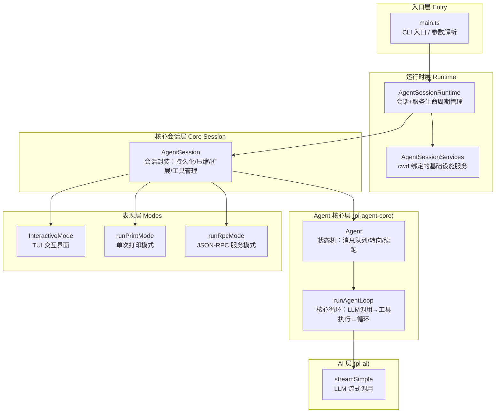
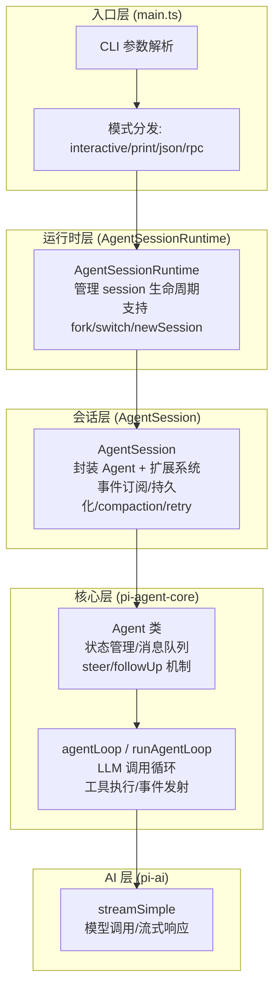

[TOC]

---
## pi-coding-agent 源码分析-v1

Read [](./pi-0.78.0/packages/coding-agent/src/index.ts#1-1), lines 1 to 100

Read [](./pi-0.78.0/packages/coding-agent/src/core)

Read [](./pi-0.78.0/packages/coding-agent/src/cli)

Read [](./pi-0.78.0/packages/coding-agent/src/modes)

Read [](./pi-0.78.0/packages/agent/src/index.ts)

Read [](./pi-0.78.0/packages/agent/src/agent.ts#1-1), lines 1 to 100

Read [](./pi-0.78.0/packages/agent/src/agent.ts#100-100), lines 100 to 200

Read [](./pi-0.78.0/packages/coding-agent/src/modes/index.ts)

Read [](./pi-0.78.0/packages/coding-agent/src/core/agent-session-runtime.ts#1-1), lines 1 to 100

Read [](./pi-0.78.0/packages/agent/src/harness/agent-harness.ts#1-1), lines 1 to 100

Read [](./pi-0.78.0/packages/coding-agent/src/core/agent-session.ts#1-1), lines 1 to 100

Read [](./pi-0.78.0/packages/agent/src/agent.ts#200-200), lines 200 to 200

Read [](./pi-0.78.0/packages/agent/src/harness/agent-harness.ts#100-100), lines 100 to 200

Read [](./pi-0.78.0/packages/coding-agent/src/core/agent-session.ts#100-100), lines 100 to 200

Read [](./pi-0.78.0/packages/coding-agent/src/core/sdk.ts#1-1), lines 1 to 100

Read [](./pi-0.78.0/packages/coding-agent/src/modes/interactive/interactive-mode.ts#1-1), lines 1 to 100

Read [](./pi-0.78.0/packages/agent/src/harness/agent-harness.ts#200-200), lines 200 to 300

Read [](./pi-0.78.0/packages/coding-agent/src/core/agent-session.ts#200-200), lines 200 to 300

Read [](./pi-0.78.0/packages/coding-agent/src/core/sdk.ts#100-100), lines 100 to 200

Read [](./pi-0.78.0/packages/agent/src/agent-loop.ts#1-1), lines 1 to 100

Read [](./pi-0.78.0/packages/coding-agent/src/core/agent-session.ts#300-300), lines 300 to 400

Read [](./pi-0.78.0/packages/coding-agent/src/core/sdk.ts#200-200), lines 200 to 300

Read [](./pi-0.78.0/packages/agent/src/agent-loop.ts#100-100), lines 100 to 200

Read [](./pi-0.78.0/packages/agent/src/types.ts#1-1), lines 1 to 100

Read [](./pi-0.78.0/packages/coding-agent/src/core/agent-session.ts#400-400), lines 400 to 500

Read [](./pi-0.78.0/packages/agent/src/harness/agent-harness.ts#300-300), lines 300 to 400

Read [](./pi-0.78.0/packages/coding-agent/src/core/sdk.ts#300-300), lines 300 to 400

Read [](./pi-0.78.0/packages/coding-agent/src/core/agent-session.ts#500-500), lines 500 to 600

Read [](./pi-0.78.0/packages/coding-agent/src/core/sdk.ts#400-400), lines 400 to 433

Read [](./pi-0.78.0/packages/agent/src/harness/agent-harness.ts#400-400), lines 400 to 500

Read [](./pi-0.78.0/packages/coding-agent/src/core/agent-session.ts#600-600), lines 600 to 700

Read [](./pi-0.78.0/packages/coding-agent/src/core/agent-session.ts#700-700), lines 700 to 800

Read [](./pi-0.78.0/packages/coding-agent/src/core/agent-session.ts#800-800), lines 800 to 900

Read [](./pi-0.78.0/packages/coding-agent/src/core/agent-session.ts#900-900), lines 900 to 1100

Read [](./pi-0.78.0/packages/coding-agent/src/main.ts#200-200), lines 200 to 550

Read [](./pi-0.78.0/packages/coding-agent/src/main.ts#550-550), lines 550 to 787

Searched for text `AgentHarness` (`**/packages/coding-agent/src/**`), no results

Searched for text `createAgentSessionFromServices` (`**/packages/coding-agent/src/**`), 11 results

Read [](./pi-0.78.0/packages/coding-agent/src/core/agent-session-services.ts#1-1), lines 1 to 100

Read [](./pi-0.78.0/packages/coding-agent/src/core/agent-session-services.ts#100-100), lines 100 to 202

Read [](./pi-0.78.0/packages/coding-agent/src/core/messages.ts#1-1), lines 1 to 100

Searched for text `from "@earendil-works/pi-agent-core"` (`**/packages/coding-agent/**`), 20 results

Read [](./pi-0.78.0/packages/coding-agent/src/core/messages.ts#100-100), lines 100 to 100

Read [](./pi-0.78.0/packages/coding-agent/src/core/messages.ts#100-100), lines 100 to 196

Read [](./pi-0.78.0/packages/agent/src/harness/messages.ts#1-1), lines 1 to 100

Searched for text `AgentHarness` (`**/packages/coding-agent/src/**`), no results

Searched for text `from "@earendil-works/pi-agent-core"` (`**/packages/coding-agent/src/**`), 20 results

Read [](./pi-0.78.0/packages/agent/src/agent.ts#300-300), lines 300 to 400

Read [](./pi-0.78.0/packages/coding-agent/src/core/tools/index.ts#1-1), lines 1 to 100

现在我已经收集了足够的上下文，下面给出完整的分析。

---

### 一、整体设计思路

pi-coding-agent 是一个**分层的、面向 CLI 的编码 Agent 应用**，其架构可以概括为：



**核心设计原则：**

1. **关注点分离**：main.ts 只管 CLI 参数解析和流程编排；`AgentSession` 管业务逻辑；`Agent`（来自 pi-agent-core）管 LLM 交互循环；表现层（Interactive/Print/RPC）只管 I/O。

2. **cwd 绑定服务**：`AgentSessionServices` 封装了所有与当前工作目录绑定的基础设施（认证、设置、模型注册表、资源加载器），当会话切换到不同项目时，这些服务会被重新创建。

3. **事件驱动架构**：`Agent` 发出事件 → `AgentSession._handleAgentEvent` 统一处理（持久化、扩展事件转发、自动压缩检查、重试逻辑）→ 再转发给 UI 层监听器。

4. **SDK 化设计**：sdk.ts 中的 `createAgentSession()` 是可编程调用的公开 API，main.ts 只是它的一个 CLI 消费者。

---

### 二、整体执行流程

以交互模式为例，完整流程如下：

#### 阶段 1：CLI 启动 (main.ts)

```
parseArgs() → resolveAppMode() → validateFlags()
  → runMigrations()
  → createSessionManager()     // 处理 --session/--resume/--continue/--fork
  → 构建 createRuntime 工厂闭包
  → createAgentSessionRuntime()
```

`createSessionManager()` 根据 CLI 参数决定会话来源：
- `--no-session`：内存会话（不持久化）
- `--fork <path>`：从已有会话 fork 出新会话
- `--session <id>`：打开指定会话
- `--resume`：交互式选择历史会话
- `--continue`：继续最近的会话
- 默认：创建新会话

#### 阶段 2：运行时创建 (agent-session-runtime.ts + agent-session-services.ts)

```
createAgentSessionServices({cwd, agentDir, ...})
  → 创建 AuthStorage, SettingsManager, ModelRegistry
  → 创建 DefaultResourceLoader（加载 skills/prompts/themes/extensions）
  → 注册扩展提供的 provider

createAgentSessionFromServices({services, sessionManager, model, ...})
  → createAgentSession()  [sdk.ts]
```

#### 阶段 3：Agent 创建 (sdk.ts → `createAgentSession()`)

这是 pi-coding-agent **桥接 pi-agent-core 的关键位置**：

```typescript
// sdk.ts 中创建 Agent 实例
agent = new Agent({
    initialState: { systemPrompt, model, thinkingLevel, tools: [] },
    convertToLlm: convertToLlmWithBlockImages,  // 自定义消息→LLM消息转换
    streamFn: async (model, context, options) => {
        // 注入 API key、超时、重试、attribution headers
        const auth = await modelRegistry.getApiKeyAndHeaders(model);
        return streamSimple(model, context, { ...options, apiKey: auth.apiKey, ... });
    },
    sessionId: sessionManager.getSessionId(),
    transformContext: async (messages) => runner.emitContext(messages),
    steeringMode / followUpMode / transport / thinkingBudgets / maxRetryDelayMs,
});
```

然后创建 `AgentSession` 包装这个 `Agent`：

```typescript
const session = new AgentSession({
    agent,
    sessionManager,
    settingsManager,
    cwd,
    resourceLoader,
    modelRegistry,
    // ...
});
```

#### 阶段 4：模式运行

```typescript
if (appMode === "rpc") {
    await runRpcMode(runtime);
} else if (appMode === "interactive") {
    const interactiveMode = new InteractiveMode(runtime, { ... });
    await interactiveMode.run();
} else {
    await runPrintMode(runtime, { ... });
}
```

#### 阶段 5：单次 Prompt 执行链路

当用户输入一条消息时：

```
AgentSession.prompt(text)
  → 扩展命令检查（/command）
  → 扩展 input 事件拦截
  → Skill/Prompt 模板展开
  → 如果在 streaming → steer() 或 followUp() 队列
  → 否则 → 验证 model/apiKey
  → 检查是否需要 compaction
  → 构建 AgentMessage[]
  → 扩展 before_agent_start 事件
  → agent.prompt(messages)
      → runAgentLoop(messages, context, config, emit, signal, streamFn)
          → [循环]
              → streamAssistantResponse() → streamSimple() → LLM 调用
              → 解析 tool_calls
              → beforeToolCall 钩子（扩展拦截）
              → 执行工具
              → afterToolCall 钩子（扩展修改结果）
              → 检查 steering/followUp 队列
              → 继续循环或结束
  → _handlePostAgentRun()
      → 检查重试（retryable error）
      → 检查自动压缩（token 阈值）
      → 检查队列中是否有新消息需要继续
```

---

### 三、如何基于 pi-agent-core 实现

pi-coding-agent **直接使用 `Agent` 类**（而非 `AgentHarness`），通过以下机制在 `Agent` 基础上构建了完整的编码 Agent 功能：

#### 3.1 `Agent` 提供的核心能力（来自 agent.ts）

| 能力           | 说明                                                         |
| -------------- | ------------------------------------------------------------ |
| **状态管理**   | `AgentState`：messages、tools、systemPrompt、model、thinkingLevel、isStreaming |
| **消息队列**   | `steeringQueue`（中断当前响应）、`followUpQueue`（等待当前完成后处理） |
| **生命周期**   | `prompt()` → `runAgentLoop()` → 事件流 → `agent_end`         |
| **续跑**       | `continue()` → `runAgentLoopContinue()`                      |
| **钩子**       | `beforeToolCall`、`afterToolCall`、`prepareNextTurn`、`transformContext` |
| **可替换组件** | `streamFn`、`convertToLlm`、`getApiKey`、`onPayload`、`onResponse` |

#### 3.2 pi-coding-agent 在 `Agent` 之上的增强

**a) 自定义 `streamFn`**（`sdk.ts:340-370`）

注入 API key 解析、超时配置、重试策略、attribution headers（OpenRouter/Cloudflare 等）：

```typescript
streamFn: async (model, context, options) => {
    const auth = await modelRegistry.getApiKeyAndHeaders(model);
    return streamSimple(model, context, {
        ...options,
        apiKey: auth.apiKey,
        timeoutMs, maxRetries, maxRetryDelayMs,
        headers: { ...attributionHeaders, ...auth.headers, ...options.headers },
    });
},
```

**b) 自定义 `convertToLlm`**（`core/messages.ts`）

pi-agent-core 的 `AgentMessage` 只支持 `user/assistant/toolResult` 三种角色。pi-coding-agent 扩展了自定义消息类型：

- `bashExecution` → 转换为 user 消息（包含命令输出）
- `custom` → 扩展注入的自定义消息
- `branchSummary` / `compactionSummary` → 转换为带 XML 标签的 user 消息

通过 TypeScript 的 declaration merging 扩展 `CustomAgentMessages` 接口。

**c) 工具系统**（`core/tools/`）

pi-coding-agent 定义了 7 个内置工具，每个工具都有双重形态：
- `AgentTool`（给 `Agent` 使用，符合 pi-agent-core 的工具接口）
- `ToolDefinition`（给扩展系统使用，包含更多元数据如 `promptGuidelines`、`sourceInfo`）

工具通过 `_buildRuntime()` 注册到 `AgentSession` 的内部注册表，然后设置到 `agent.state.tools`。

**d) 会话持久化**（`AgentSession._handleAgentEvent`）

监听 `Agent` 的 `message_end` 事件，将每条消息实时写入 JSONL 文件（通过 `SessionManager.appendMessage()`）。同时记录 model 变更、thinking level 变更等元数据。

**e) 自动压缩（Compaction）**

在 `_handlePostAgentRun()` 中检查 token 使用量，超过阈值时自动触发压缩：用一个小模型对历史对话做摘要，替换掉旧消息。

**f) 自动重试**

当 assistant 消息的 `stopReason === "error"` 且错误可重试时（如 rate limit、server error），自动以指数退避重试。

**g) 扩展系统**（`core/extensions/`）

通过 `Agent` 的钩子机制实现：
- `beforeToolCall` → 扩展的 `tool_call` 事件（可阻止工具执行）
- `afterToolCall` → 扩展的 `tool_result` 事件（可修改工具结果）
- `transformContext` → 扩展的 `context` 事件（可修改发送给 LLM 的上下文）
- `onPayload` / `onResponse` → 扩展的 provider 请求/响应拦截

**h) 模型注册表**（`ModelRegistry`）

管理 API key、OAuth 凭证、模型发现和选择，在 `streamFn` 中自动解析。

#### 3.3 与 `AgentHarness` 的关系

值得注意的是，pi-coding-agent **没有使用** `AgentHarness`。`AgentHarness`（agent-harness.ts）是 pi-agent-core 提供的另一个更高层的封装，它自己管理 session、compaction、skills、prompt templates 等。

pi-coding-agent 选择了**直接使用底层的 `Agent` 类**，然后自己实现了与 `AgentHarness` 功能重叠但更贴合编码场景的 `AgentSession`。两者的功能对比：

| 功能             | AgentHarness (pi-agent-core) | AgentSession (pi-coding-agent)  |
| ---------------- | ---------------------------- | ------------------------------- |
| Session 持久化   | 通用 JSONL repo              | 专为编码场景的 SessionManager   |
| Compaction       | 内置                         | 内置（代码独立但逻辑相似）      |
| Skills           | 内置                         | 通过 ResourceLoader 加载        |
| Prompt Templates | 内置                         | 通过 ResourceLoader 加载        |
| 扩展系统         | 无                           | 完整的 ExtensionRunner          |
| 工具管理         | 通用                         | 7 个编码专用工具                |
| 模型注册         | 无                           | ModelRegistry + AuthStorage     |
| 设置管理         | 无                           | SettingsManager（多层配置合并） |
| Bash 执行        | 无                           | 内置 bash executor              |
| 多模式           | 无                           | Interactive / Print / RPC       |

---

### 总结

pi-coding-agent 的架构可以概括为：

> **`Agent`（pi-agent-core）提供纯粹的 LLM Agent 循环能力 → `AgentSession` 在此基础上叠加编码场景所需的全部功能（持久化、压缩、工具、扩展、认证、设置）→ `AgentSessionRuntime` 管理会话和服务的生命周期 → main.ts + Modes 提供 CLI 入口和多种交互模式。**

这种设计使得 `Agent` 保持简洁通用，而所有编码场景的复杂性都被封装在 `AgentSession` 层，两者通过依赖注入（`streamFn`、`convertToLlm`、钩子函数）松耦合地连接。


------
## pi-coding-agent 源码分析-v2

我来系统性地分析 pi-coding-agent 的源码。先从关键文件入手，收集足够的上下文。

Read [](./pi-0.78.0/packages/agent/src/agent.ts#1-1), lines 1 to 80

Read [](./pi-0.78.0/packages/agent/src/types.ts#1-1), lines 1 to 80

Read [](./pi-0.78.0/packages/coding-agent/src/core/sdk.ts#1-1), lines 1 to 80

Read [](./pi-0.78.0/packages/coding-agent/src/core/agent-session-runtime.ts#1-1), lines 1 to 80

Read [](./pi-0.78.0/packages/coding-agent/src/core/sdk.ts#80-80), lines 80 to 160

Read [](./pi-0.78.0/packages/coding-agent/src/core/agent-session.ts#1-1), lines 1 to 100

Read [](./pi-0.78.0/packages/coding-agent/src/core/agent-session-services.ts#1-1), lines 1 to 100

Read [](./pi-0.78.0/packages/agent/src/agent-loop.ts#1-1), lines 1 to 100

Read [](./pi-0.78.0/packages/agent/src/agent-loop.ts#100-100), lines 100 to 200

Read [](./pi-0.78.0/packages/coding-agent/src/core/agent-session.ts#100-100), lines 100 to 200

Read [](./pi-0.78.0/packages/coding-agent/src/core/sdk.ts#160-160), lines 160 to 200

Searched for files matching `**/packages/coding-agent/src/modes/**/*.ts`, 20 matches

Read [](./pi-0.78.0/packages/coding-agent/src/core/agent-session.ts#200-200), lines 200 to 300

Read [](./pi-0.78.0/packages/coding-agent/src/core/sdk.ts#200-200), lines 200 to 300

Read [](./pi-0.78.0/packages/coding-agent/src/core/sdk.ts#300-300), lines 300 to 400

Read [](./pi-0.78.0/packages/coding-agent/src/modes/print-mode.ts#1-1), lines 1 to 100

Read [](./pi-0.78.0/packages/coding-agent/src/modes/interactive/interactive-mode.ts#1-1), lines 1 to 100

Read [](./pi-0.78.0/packages/coding-agent/src/modes/index.ts)

Read [](./pi-0.78.0/packages/coding-agent/src/core/agent-session.ts#300-300), lines 300 to 500

Read [](./pi-0.78.0/packages/agent/src/agent.ts#80-80), lines 80 to 200

Read [](./pi-0.78.0/packages/agent/src/index.ts)

Read [](./pi-0.78.0/packages/agent/src/agent.ts#200-200), lines 200 to 300

Read [](./pi-0.78.0/packages/coding-agent/src/core/agent-session.ts#500-500), lines 500 to 700

Read [](./pi-0.78.0/packages/agent/src/agent.ts#300-300), lines 300 to 400

Read [](./pi-0.78.0/packages/coding-agent/src/core/agent-session.ts#700-700), lines 700 to 900

Searched for text `async prompt\(` (`**/packages/coding-agent/src/core/agent-session.ts`), 1 result

Searched for text `_buildRuntime\(` (`**/packages/coding-agent/src/core/agent-session.ts`), 3 results

Read [](./pi-0.78.0/packages/coding-agent/src/core/agent-session.ts#980-980), lines 980 to 1100

Read [](./pi-0.78.0/packages/coding-agent/src/core/agent-session.ts#2368-2368), lines 2368 to 2500

Read [](./pi-0.78.0/packages/coding-agent/src/core/agent-session.ts#1100-1100), lines 1100 to 1200

Read [](./pi-0.78.0/packages/agent/src/agent.ts#400-400), lines 400 to 500

Read [](./pi-0.78.0/packages/coding-agent/src/core/agent-session-runtime.ts#80-80), lines 80 to 200

Searched for text `createAgentSessionFromServices` (`**/packages/coding-agent/src/core/sdk.ts`), no results

Searched for text `export async function createAgentSessionFromServices` (`**/packages/coding-agent/src/core/sdk.ts`), no results

Searched for text `createAgentSessionFromServices` (`**/packages/coding-agent/src/core/sdk.ts`), no results

Searched for text `createAgentSessionFromServices` (`**/packages/coding-agent/src/core/sdk.ts`), no results

Searched for text `createAgentSessionFromServices` (`**/packages/coding-agent/src/core`), no results

Read [](./pi-0.78.0/packages/coding-agent/src/core/agent-session-services.ts#100-100), lines 100 to 200

现在我已经收集了足够的上下文，下面给出完整分析。

---

### 一、整体设计思路

pi-coding-agent 是一个**分层架构**的 CLI Agent 应用，核心设计理念是 **"关注点分离 + 可组合的 SDK"**：



**关键设计决策：**

1. **SDK 化设计**：sdk.ts 暴露 `createAgentSession()` 作为公共 API，第三方可以像用库一样嵌入 pi-coding-agent
2. **服务与会话分离**：`createAgentSessionServices()` 创建基础设施（settings、auth、model registry、resource loader），`createAgentSessionFromServices()` 再基于这些服务创建会话——这样可以在不同 cwd 之间复用/重建服务
3. **模式无关的会话核心**：`AgentSession` 不依赖任何 I/O 模式（TUI/print/JSON-RPC），所有模式共享同一套会话逻辑
4. **扩展系统贯穿全栈**：extensions 可以在 tool call 前后、消息收发、provider 请求/响应等各个环节介入

---

### 二、整体执行流程

从 `main.ts` 的 `main()` 函数出发，完整流程如下：

#### 阶段 1：启动前处理

```
main(args)
  ├── 环境检查: offline mode, Windows 自更新清理
  ├── handlePackageCommand / handleConfigCommand (子命令分发)
  ├── parseArgs() → 解析 CLI 参数
  ├── resolveAppMode() → 确定运行模式
  │     - interactive (默认, TTY)
  │     - print (-p 或管道输入)
  │     - json (--mode json)
  │     - rpc (--mode rpc)
  ├── validateForkFlags / validateSessionIdFlags
  └── runMigrations() → 迁移旧配置
```

#### 阶段 2：会话创建

```
createSessionManager()
  ├── --no-session → SessionManager.inMemory()
  ├── --fork <id> → SessionManager.forkFrom()
  ├── --session <id> → SessionManager.open()
  ├── --resume → selectSession() 交互式选择
  ├── --continue → SessionManager.continueRecent()
  └── 默认 → SessionManager.create() 新建
```

#### 阶段 3：运行时组装（核心）

这是最关键的部分，通过 **工厂模式 + 闭包** 实现延迟绑定：

```typescript
// main.ts 中定义 createRuntime 工厂（闭包捕获 CLI 参数）
const createRuntime: CreateAgentSessionRuntimeFactory = async ({
    cwd, agentDir, sessionManager, sessionStartEvent
}) => {
    // Step 1: 创建 cwd 绑定的服务
    const services = await createAgentSessionServices({ cwd, agentDir, ... });

    // Step 2: 解析模型范围（--models 参数）
    const scopedModels = await resolveModelScope(modelPatterns, modelRegistry);

    // Step 3: 构建会话选项
    const { options: sessionOptions } = buildSessionOptions(parsed, scopedModels, ...);

    // Step 4: 创建 AgentSession
    const created = await createAgentSessionFromServices({
        services, sessionManager, ...sessionOptions
    });

    return { ...created, services, diagnostics };
};

// 然后通过 AgentSessionRuntime 包装
const runtime = await createAgentSessionRuntime(createRuntime, {
    cwd, agentDir, sessionManager
});
```

`createAgentSession()` 内部（sdk.ts）：
1. 创建 `AuthStorage`、`ModelRegistry`、`SettingsManager`
2. 创建 `DefaultResourceLoader` 并 `reload()`（加载扩展、技能、提示模板、主题）
3. 解析/恢复模型和 thinking level
4. **创建 `Agent` 实例**（来自 `pi-agent-core`），注入：
   - `streamFn`：封装了 API key 获取、超时、重试、attribution headers
   - `convertToLlm`：消息格式转换 + 图片过滤
   - `onPayload/onResponse`：扩展拦截点
   - `transformContext`：扩展上下文转换
5. 用 `AgentSession` 包装 `Agent`

#### 阶段 4：模式分发

```
appMode === "interactive"
  → new InteractiveMode(runtime, {...}).run()
     └── TUI 渲染循环，用户输入 → session.prompt() → Agent.prompt() → runAgentLoop()

appMode === "print" / "json"
  → runPrintMode(runtime, {...})
     └── session.prompt() → 等待 agent_end → 输出结果 → 退出

appMode === "rpc"
  → runRpcMode(runtime)
     └── JSON-RPC over stdin/stdout
```

#### 阶段 5：一次 prompt 的完整链路

```
用户输入 "hello"
  → InteractiveMode 捕获输入
  → session.prompt("hello")
    → 扩展命令检查 (/xxx)
    → 扩展 input 事件拦截
    → skill/template 展开
    → 检查是否需要 compaction
    → 构建 AgentMessage[]
    → 扩展 before_agent_start 事件
    → agent.prompt(messages)
      → runWithLifecycle()
        → runAgentLoop(messages, context, config, emit, signal, streamFn)
          → [循环]
            → emit turn_start
            → 注入 steering/followUp 队列消息
            → streamAssistantResponse() → streamFn() → streamSimple() → LLM API
            → 解析 tool calls
            → beforeToolCall 钩子（扩展可拦截）
            → 执行工具（read/bash/edit/write...）
            → afterToolCall 钩子（扩展可修改结果）
            → emit tool_execution_start/update/end
            → 将 tool results 加入上下文
            → 继续循环直到无更多 tool calls
            → emit turn_end
            → 检查 steering/followUp 队列 → 继续或停止
          → emit agent_end
      → AgentSession._handleAgentEvent 处理事件
        → 扩展事件转发
        → 会话持久化（message_end → sessionManager.appendMessage）
        → 自动 compaction 检查
        → 自动 retry 检查
```

---

### 三、如何基于 pi-agent-core 的 Agent 实现

pi-coding-agent **不是直接使用** `pi-agent-core` 的 `Agent` 类，而是通过 **包装 + 增强** 的模式：

#### 1. Agent 的创建与注入（sdk.ts）

```typescript
// pi-coding-agent 创建 pi-agent-core 的 Agent 实例
agent = new Agent({
    initialState: { systemPrompt, model, thinkingLevel, tools: [] },
    convertToLlm: convertToLlmWithBlockImages,  // 自定义消息转换
    streamFn: async (model, context, options) => {
        // 封装：注入 API key、超时、重试、headers
        const auth = await modelRegistry.getApiKeyAndHeaders(model);
        return streamSimple(model, context, { ...options, apiKey: auth.apiKey, ... });
    },
    onPayload: ...,   // 扩展拦截
    onResponse: ...,  // 扩展拦截
    transformContext: ..., // 扩展上下文转换
    sessionId: ...,
    steeringMode: ...,
    followUpMode: ...,
    transport: ...,
    thinkingBudgets: ...,
});
```

#### 2. AgentSession 对 Agent 的包装（agent-session.ts）

`AgentSession` 是核心包装层，它：

- **持有 `Agent` 实例** 作为 `readonly agent: Agent`
- **订阅 Agent 事件**：`this.agent.subscribe(this._handleAgentEvent)`
- **在事件处理中注入额外逻辑**：

| Agent 事件    | AgentSession 的增强处理                           |
| ------------- | ------------------------------------------------- |
| `message_end` | 会话持久化（写入 JSONL）、跟踪最后 assistant 消息 |
| `agent_end`   | 自动 compaction 检查、自动 retry 判断             |
| 所有事件      | 转发给扩展系统（`ExtensionRunner`）               |
| 所有事件      | 转发给 UI 层监听器                                |

- **安装工具钩子**：`_installAgentToolHooks()` 在 `Agent.beforeToolCall` / `Agent.afterToolCall` 上注入扩展拦截逻辑
- **管理工具注册表**：`_buildRuntime()` 从 `createAllToolDefinitions()` 获取工具定义，通过 `_refreshToolRegistry()` 注册到 Agent
- **管理系统提示词**：`_rebuildSystemPrompt()` 根据活跃工具动态构建

#### 3. Agent 的核心能力（`pi-agent-core`）

`Agent` 类本身提供：

- **状态管理**：`state.messages`、`state.tools`、`state.model`、`state.thinkingLevel`
- **消息队列**：`steer()`（插队，当前 turn 结束后立即注入）、`followUp()`（排队，agent 空闲后注入）
- **生命周期**：`prompt()` → `runAgentLoop()` → 循环调用 LLM + 执行工具
- **事件系统**：`subscribe()` 监听 `agent_start`、`turn_start`、`message_start`、`message_update`、`message_end`、`tool_execution_*`、`turn_end`、`agent_end`
- **并发控制**：`activeRun` 确保同时只有一个 run，`abort()` 取消当前 run
- **工具执行模式**：`sequential` / `parallel`

#### 4. 架构关系总结

```
pi-ai (底层)
  └── streamSimple() — 调用 LLM API，流式返回

pi-agent-core (中间层)
  └── Agent — 状态管理 + 消息队列 + 事件发射
  └── runAgentLoop() — LLM 调用循环 + 工具执行循环
  └── agentLoop / agentLoopContinue — 公共入口

pi-coding-agent (应用层)
  └── AgentSession — 包装 Agent，添加：
      ├── 会话持久化（JSONL）
      ├── 扩展系统集成
      ├── 自动 compaction
      ├── 自动 retry
      ├── 工具注册表管理
      ├── 系统提示词构建
      └── bash 执行管理
  └── AgentSessionRuntime — 管理 session 生命周期
      ├── fork / switch / newSession
      └── 服务重建（cwd 切换时）
  └── main.ts — CLI 入口 + 模式分发
  └── InteractiveMode / PrintMode / RpcMode — I/O 层
```

**关键点**：pi-coding-agent 并没有 fork/修改 pi-agent-core 的代码，而是通过 `Agent` 提供的扩展点（`streamFn`、`convertToLlm`、`beforeToolCall`、`afterToolCall`、`transformContext`、`onPayload`、`onResponse`、事件订阅）来实现所有上层功能。这是一种典型的 **"框架提供扩展点，应用层实现"** 的设计模式。


### 与`AgentHarness`的关系

Q：请帮我确认下，pi-coding-agent里没有使用pi-agent-core里的harness模块提供的AgentHarness类吗？

A：好问题，让我来确认一下。

Searched for text `AgentHarness` (`**/packages/coding-agent`), no results

Searched for text `agent-harness` (`**/packages/coding-agent`), no results

Searched for text `from "@earendil-works/pi-agent-core"` (`**/packages/coding-agent`), no results

Searched for text `AgentHarness` (`**/packages/coding-agent`), no results

Searched for text `pi-agent-core` (`**/packages/coding-agent`), no results

Searched for text `pi-agent` (`**/packages/coding-agent/src`), no results

Read [](./pi-0.78.0/packages/coding-agent/package.json#1-1), lines 1 to 50

Searched for text `@earendil-works/pi-agent` (`**/packages/coding-agent/src`), no results

Searched for text `pi-agent-core` (`**/packages/coding-agent/src`), no results

Searched for text `pi-agent-core` (`**/packages/coding-agent/src/**/*.ts`), 20 results

Searched for text `harness` (`**/packages/coding-agent/src`), no results

Read [](./pi-0.78.0/packages/agent/src/harness/agent-harness.ts#1-1), lines 1 to 30

Read [](./pi-0.78.0/packages/coding-agent/src/core/agent-session.ts#18-18), lines 18 to 30

**确认：pi-coding-agent 完全没有使用 `AgentHarness`。**

证据如下：

#### 1. 零引用

在整个 src 目录中搜索 `AgentHarness` 和 `harness`，结果均为 **0 matches**。

#### 2. pi-coding-agent 从 pi-agent-core 实际导入了什么

从 `@earendil-works/pi-agent-core` 导入的内容仅限于：

| 导入项          | 类型     | 使用位置                         |
| --------------- | -------- | -------------------------------- |
| `Agent`         | **类**   | sdk.ts — 直接 `new Agent({...})` |
| `AgentEvent`    | 类型     | agent-session.ts, rpc-client.ts  |
| `AgentMessage`  | 类型     | 多处                             |
| `AgentState`    | 类型     | agent-session.ts                 |
| `AgentTool`     | 类型     | 各工具文件                       |
| `ThinkingLevel` | 类型     | 多处                             |
| `StreamFn`      | 类型     | compaction.ts                    |
| `uuidv7`        | 工具函数 | session-manager.ts               |

**没有** `AgentHarness`，也没有任何 `harness/` 子路径的导入。

#### 3. 为什么不用 AgentHarness

`AgentHarness`（定义在 agent-harness.ts）是一个更高层的封装，它在 `Agent` + `runAgentLoop` 之上额外提供了：

- 事件驱动的 phase 管理（`AgentHarnessPhase`）
- 内置的 compaction、branch summarization 集成
- skill/prompt template 展开
- 结构化的 `AgentHarnessEvent` 事件系统

而 pi-coding-agent 选择了**直接使用底层 `Agent` 类**，然后自己在 `AgentSession` 中重新实现了这些能力：

| AgentHarness 提供的功能 | pi-coding-agent 的实现方式                                   |
| ----------------------- | ------------------------------------------------------------ |
| compaction              | `AgentSession` 中自行调用 `compact()` / `shouldCompact()`    |
| branch summarization    | `AgentSession` 中自行管理                                    |
| skill 展开              | `AgentSession._expandSkillCommand()`                         |
| prompt template 展开    | `AgentSession.prompt()` 中调用 `expandPromptTemplate()`      |
| 事件系统                | 直接订阅 `Agent` 的原生事件，再包装为 `AgentSessionEvent`    |
| 扩展系统                | 自己实现 `ExtensionRunner`，通过 `Agent` 的钩子（`beforeToolCall`/`afterToolCall`/`onPayload`/`onResponse`/`transformContext`）注入 |

#### 结论

pi-coding-agent 和 `AgentHarness` 是**两条平行的上层封装路线**，它们都基于同一个底层 `Agent` 类构建，但互不依赖：

```
pi-agent-core
├── Agent (底层)
│   ├── AgentHarness (harness 路线 — 用于测试/评估)
│   └── AgentSession (coding-agent 路线 — 用于 CLI 应用)
```

`AgentHarness` 主要用于 **test harness / 评估场景**（从文件名 agent-harness.ts 和它在 `test/` 中的使用可以看出），而 pi-coding-agent 需要的是完整的 CLI 应用能力（TUI、会话持久化、扩展系统、多模式分发），所以选择了直接基于 `Agent` 做自己的封装。